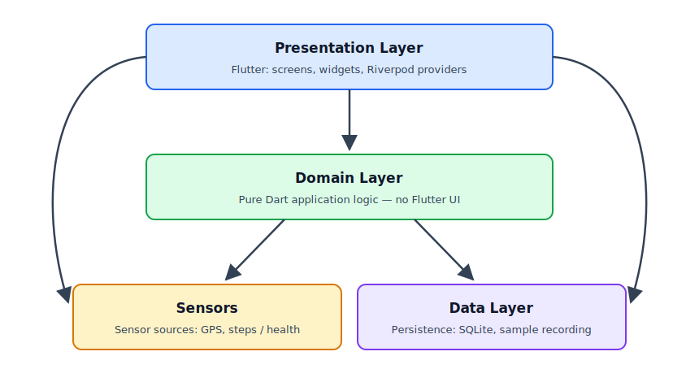

# Architecture of the 6MWT App

## Layers
 


* Presentation Layer: Flutter GUI. 
  * Allowed to interact with Data Layer directly
  * Riverpod-Provider go here
* Domain Layer: pure dart (no flutter) application logic
  * Flutter Plugin Datatypes are allowed like Position from geolocator
* Data Layer: Persistence
  * SQLite Storage
* Sensors: Sensor sources with interfaces
  * GPS, steps, health

## Directory Structure

Should be state (some directories are not created yet):

```
lib/
├── core/                   # Shared code between features
│   ├── sensors/            # SensorSource interface + implementations
│   ├── domain/             # pure Dart logic, no Flutter imports
│   ├── data/               # persistence
│   └── presentation/       # Shared Flutter Widgets
├── features/               # Feature specific code. Code in a feature directory is not allowed to reference code in a different feature directory
│   ├── debug/              # gps debug screen
│   ├── walk/               # walk test (screen, logic etc.)
│   ├── results/            # result + fitness rating
│   ├── home/               # Home screen
│   └── profile/            # personal data
├── app/                    # Global app config, router etc.
└── main.dart
```

If necessary, feature directories can be further subdivided into sensors, domain, data, presentation


## Potential Sensor pipeline (central abstraction)

Maybe Something like:

```dart
abstract class SensorSource {
  String get id;                    // e.g. "gps", "healthkit_hr", "gadgetbridge_spo2"
  Stream<SensorSample> get samples; // sample = timestamp + type + values
  Future<void> start();
  Future<void> stop();
}
```

Independent consumers subscribe to the active sources:

| Consumer | Responsibility |
|---|---|
| **Recorder** | Persists every raw sample to the local DB. The CSV/JSON export for algorithm development is just a query over this table. |
| **Aggregators** | Condense streams into metrics, e.g. `DistanceEstimator` (interface; currently GPS-based, later swappable for step-based or sensor-fusion variants). Probably has to be modified to be compatible. |

Which sources are active is configured per test mode. This makes the watch-only test a non-special case: the watch is simply another `SensorSource`.

New distance algorithms can be developed and compared offline against the recorded raw data.


## Technologies

| Component | Choice | Rationale |
|---|---|---|
| State management / DI | **Riverpod** | Connects the UI to the engine without the engine knowing Flutter; easy to test. |
| Navigation | **go_router** | Declarative routes for the many screens. |

### Potential future technologies


| Component | Choice | Rationale |
|---|---|---|
| Database | **drift** (SQLite) | Type-safe queries; suited for the large sample table; export is trivial. `shared_preferences` only for settings. |
| Background | **flutter_foreground_task** (Android), background location mode (iOS) | Requires a UI-free engine. |
| Health data | **health** package | One API for HealthKit and Health Connect; fits behind `SensorSource`. |
| Steps / acceleration | `pedometer` / `sensors_plus` | Each its own `SensorSource`. |
